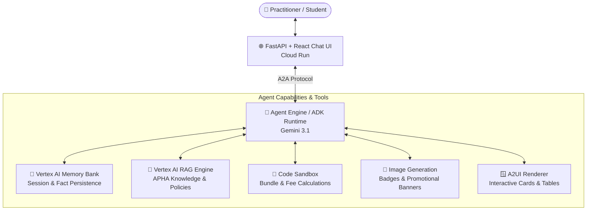

<div align="center">

# 🌟 APHA Community & Learning Assistant

### A conversational AI agent helping Pranic Healing students & practitioners discover workshops, track certification progress, and connect with local study groups.


</div>

---

## 📖 Overview

The **APHA Community & Learning Assistant** is an agentic web application designed for the American Pranic Healing Association (APHA) community. It guides practitioners through their certification journey, answers questions grounded in official course materials and policies, provides interactive workshop calculators, and displays upcoming events and local study groups through rich visual cards.

---

## ✨ Key Features

- 🎓 **Personalized Certification Journey**: Tracks completed prerequisites (e.g., *Basic Pranic Healing*, *Advanced Pranic Healing*, *Pranic Psychotherapy*) and active goals (e.g., *Associate Certified Pranic Healer*) across sessions.
- 📅 **Interactive Event & Study Group Lookup**: Filters upcoming APHA workshops, Twin Hearts group meditations, and local study group meetups by region, date, and experience level.
- 🪟 **Rich A2UI Display Cards & Tables**: Renders event details, schedules, and catalog entries as structured UI cards rather than plain markdown text.
- 💰 **Workshop Fee & Discount Calculator**: Dynamically calculates package bundle pricing, early-bird registration discounts, and multi-course registration fees using isolated code execution.
- 📖 **RAG-Grounded FAQ Knowledge**: Answers queries accurately on APHA policies, course prerequisites, and Pranic Healing guidelines backed by Vertex AI RAG Engine.
- 🎨 **Milestone Badges & Banners**: Generates custom digital achievement badges upon course completion and event promotional banners.

---

## 🧩 System Architecture



---

## 🧰 Technology Stack

| Layer | Component | Powered By |
|---|---|---|
| 🤖 **Core Agent** | Reasoning & Intent Routing | [ADK](https://google.github.io/adk-docs/) + [`agents-cli`](https://google.github.io/agents-cli/) |
| 🧠 **Memory** | Persistent Student Profiles & Progress | [Vertex AI Memory Bank](https://cloud.google.com/vertex-ai) |
| 📖 **RAG Engine** | Knowledge Retrieval & Grounded Q&A | Vertex AI RAG Engine |
| 🧪 **Code Sandbox** | Dynamic Pricing & Fee Calculations | Agent Platform Code Execution |
| 🪟 **Agent UI** | Interactive Cards, Tables & Catalog Views | [A2UI Protocol](https://adk.dev/integrations/a2ui/) |
| 🎨 **Image Generation** | Milestone Badges & Banners | Imagen / Gemini Visual Tools |
| 🌐 **Frontend Proxy** | Web Interface & A2A Bridge | FastAPI on [Cloud Run](https://cloud.google.com/run) |

---

## 📁 Repository Structure

```text
.
├── apha-community-learning-as/   # Core Agent codebase & A2UI / FastAPI frontend
│   ├── src/                       # Frontend UI and FastAPI proxy handlers
│   ├── agent.py                   # ADK Agent definition & tool registrations
│   ├── agents-cli-manifest.yaml   # Agent Engine deployment manifest
│   └── package.json               # Frontend dependencies & build scripts
├── .agents/                       # Antigravity agent skills & configuration
│   ├── mcp_config.json            # Model Context Protocol tools (Firebase & Developer Docs)
│   └── skills/                    # Automated workflow skills
├── create_memory_bank.py          # Vertex AI Memory Bank initialization script
├── project_brief.md               # Original project specification & eval criteria
└── README.md                      # Project documentation
```

---

## 🚀 Quickstart & Local Setup

### Prerequisites

- [Google Cloud SDK](https://cloud.google.com/sdk) (`gcloud`) authenticated via `gcloud auth login` and `gcloud auth application-default login`
- [Node.js](https://nodejs.org/) (v18+) & Python 3.10+
- [`agents-cli`](https://google.github.io/agents-cli/) installed

### 1. Clone the Repository

```bash
git clone https://github.com/elainedavid/buildwithgemini-apha-chat.git
cd buildwithgemini-apha-chat
```

### 2. Configure Environment

Create a `.env` file in the agent directory with your Google Cloud Project details:

```env
GCP_PROJECT=your-gcp-project-id
GCP_REGION=us-central1
```

### 3. Run the Agent Locally

```bash
cd apha-community-learning-as
agents-cli dev
```

---

## 💬 Sample Queries to Try

- *"I've taken Basic Pranic Healing. What upcoming Advanced courses can I take near Los Angeles, and what are the prerequisites?"*
- *"Can you calculate the total cost for registering 2 students for the Advanced Pranic Healing workshop with the early-bird discount?"*
- *"Show me upcoming Twin Hearts meditation group schedules in a card view."*
- *"Remember that I completed my Pranic Psychotherapy course in May 2026."*

---

## 📄 License

This repository was created as part of the **Build with Gemini** workshop series. Provided for demonstration purposes.
